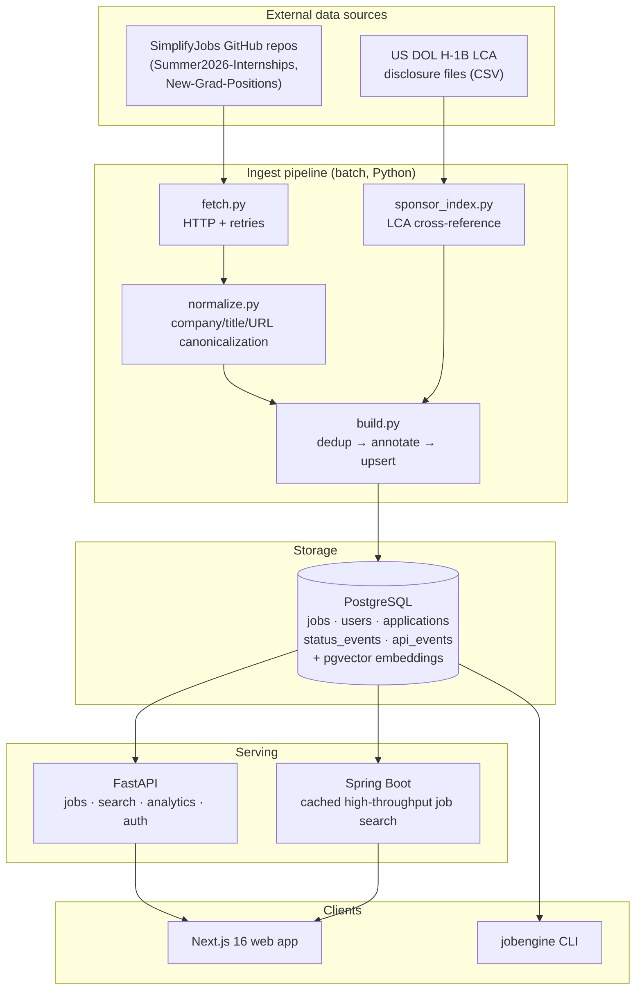
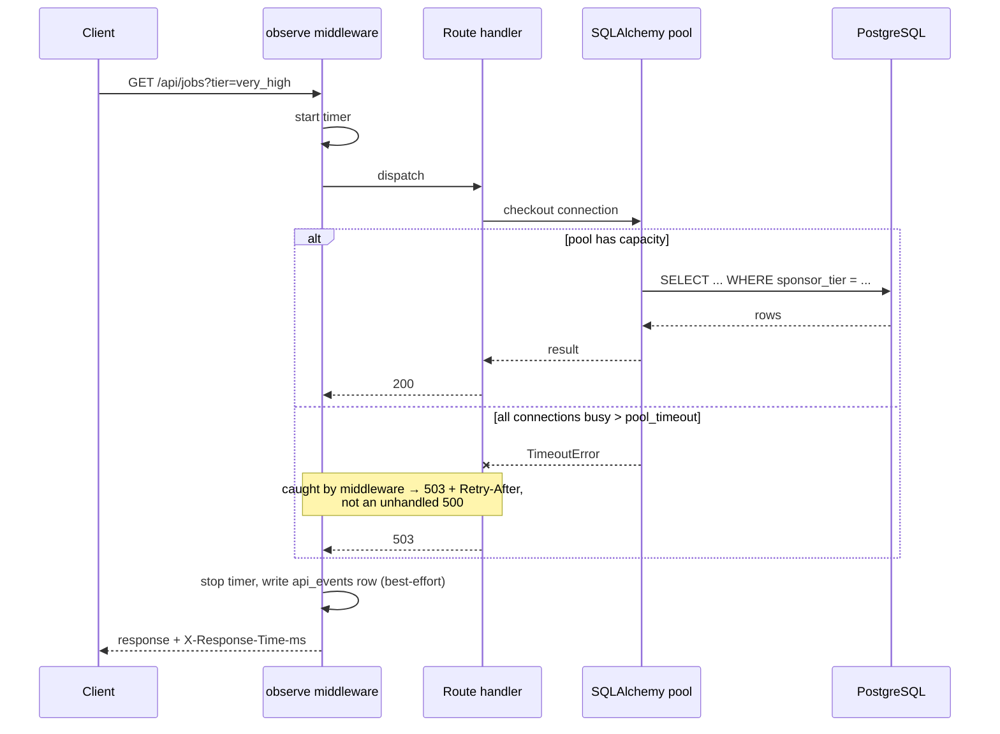

# Architecture

## System context

## The three subsystems

**1. Ingest (batch).** Runs on a schedule, not on request. `fetch.py` pulls two
JSON feeds, `normalize.py` canonicalizes company names and URLs so the same
posting from two repos collapses to one row, `sponsor_index.py` attaches an
H-1B sponsorship tier from DOL LCA filings, and `build.py` upserts the result.
This is the only writer to the `jobs` table.

**2. Serving (online).** Read-heavy. Every visitor hits `/api/jobs` before they
ever create an account, so that path is the one that gets load-tested and the
one whose latency budget matters.

**3. Tailoring (on-demand, local).** `match.py` + `metrics_audit.py` +
`tailor.py` generate a per-role resume and cover letter, gated by an audit that
rejects claims the candidate can't defend. This runs from the CLI, not the API,
because it reads a local resume file and writes local documents.

## Why the pipeline is batch and not request-time

The obvious alternative — fetch and match on each request — was rejected. The
upstream feeds update a few times a day, so per-request fetching would do
thousands of times more work for identical results, put the API's availability
at the mercy of GitHub's, and make p95 latency a function of someone else's
CDN. Batch ingest turns a network dependency into a local index lookup. The
cost is staleness bounded by the refresh interval, which is the right trade for
data that genuinely changes daily.

## Why sponsorship is a precomputed tier, not a live lookup

The DOL disclosure file is hundreds of MB of CSV. Cross-referencing it per
request is not viable, and the data only changes quarterly. `build.py` resolves
each employer to a tier once at ingest time and stores it as a column, so
`WHERE sponsor_tier = 'very_high'` is an indexed scan rather than a join against a
large external dataset.

## Service split: FastAPI and Spring Boot

The two services own different data and different consistency requirements:

| | FastAPI | Spring Boot (planned) |
|---|---|---|
| Owns | Auth, application tracker, analytics, semantic search | Cached sponsor-aware job search and corpus statistics |
| Shape | Mixed read/write, per-user workflows | Read-heavy, anonymous, high-volume |
| Consistency | Transactional for user data; eventually consistent jobs | Eventually consistent with the batch-refreshed `jobs` table |
| Why this stack | Python owns ingest, matching, and tailoring, so sharing normalization and embedding code avoids cross-language duplication | Spring/JPA gives strict schema validation and a bounded Hikari pool; Redis gives an observable read-through cache for the hottest public path |

**The honest counter-argument**, which belongs in any discussion of this
design: a single FastAPI service would be simpler, and the tracker already
works in Python. Two services means two deployments, two dependency trees, and
a network hop where there used to be a function call. The split is justified by
the domains having genuinely different scaling and consistency profiles — not
because two services is inherently better. If traffic never grows, this is
over-engineering, and that is a fair criticism.

## Request path, with the failure mode marked

The `else` branch is deliberate. Under overload, the choice is between
unbounded queueing (every client waits, then all time out at once) and fast
rejection with backpressure. Rejecting is better: it keeps latency bounded for
requests that *are* being served and tells clients to back off.

## Data flow guarantees

- **`jobs` is derived, never authoritative.** It can be dropped and rebuilt
  from upstream at any time. Nothing user-owned lives in it.
- **`applications` is authoritative and user-owned.** It is the only data whose
  loss actually matters, and the only data that needs backups.
- **`api_events` is disposable.** Losing analytics is an inconvenience, which
  is why its writes are best-effort and never block a request.

That split is why the refresh pipeline can safely truncate-and-rebuild the jobs
table without a migration story, and why backup policy can be aggressive on one
table and absent on another.
