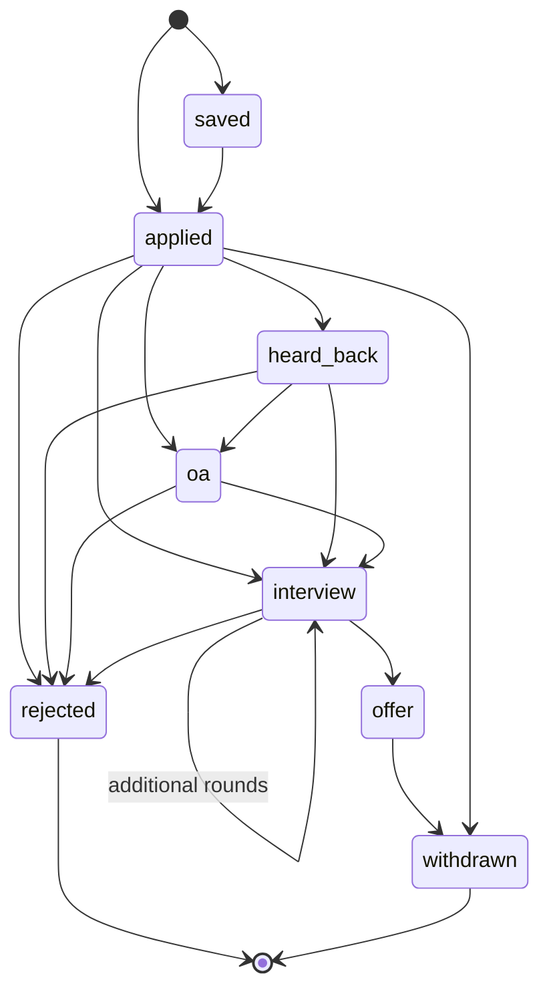

# Database design

Schema lives in [`src/jobengine/db.py`](../src/jobengine/db.py) as SQLAlchemy
Core table definitions — one portable definition that runs on SQLite (local,
tests) and PostgreSQL (deployed).

## Entity relationships

```mermaid
erDiagram
  users ||--o{ applications : "owns"
  applications ||--o{ status_events : "has history"
  jobs ||--o{ applications : "optionally sourced from"
  jobs ||--|| job_embeddings : "has vector (Postgres only)"
  users ||--o{ api_events : "optionally attributed to"

  users {
    int user_id PK
    text email UK "lowercased at write time"
    text password_hash "bcrypt"
    text created_at
  }

  applications {
    int app_id PK
    int user_id FK "NULLABLE - see note"
    text dedup_key FK "NULLABLE - manual entries have none"
    text company
    text title
    text source
    text status "state machine, see below"
    text applied_date
    text last_update
    text url
    text notes
    text contact_email
  }

  status_events {
    int event_id PK
    int app_id FK "ON DELETE CASCADE"
    text status
    text note
    text occurred_at
  }

  jobs {
    text dedup_key PK
    text company
    text company_norm "normalized for matching"
    text title
    text title_norm
    text category
    int active
    text locations "JSON array"
    text url_canon
    text sponsor_tier "derived from LCA data"
    int sponsor_lca_count
    text sponsor_match
  }

  job_embeddings {
    text dedup_key PK_FK
    vector embedding "pgvector, HNSW indexed"
  }

  api_events {
    int event_id PK
    text occurred_at
    text route "route TEMPLATE, not path"
    text method
    int status_code
    int duration_ms
    int user_id "NULLABLE - anon browsing"
  }
```

## Design decisions worth defending

### `dedup_key` as the primary key of `jobs`

Not a surrogate integer. The same posting appears in both SimplifyJobs repos
and often at multiple URLs; the natural key is a hash of the normalized
company + normalized title + canonical URL. Making it the PK means the
deduplication invariant is enforced by the database rather than by remembering
to check before every insert, and it makes the rebuild idempotent: re-running
`build.py` upserts rather than duplicating.

### `applications.user_id` is nullable and not a hard-enforced ownership column

Two access surfaces share one table. The local CLI is single-user and trusted,
and creates rows with `user_id = NULL`. The HTTP API is multi-user, always
authenticated, and always reads and writes with a concrete `user_id`. Because
every API query filters on the caller's id, CLI rows are invisible through the
API and vice versa — without maintaining two tables or a migration to merge
them later.

The risk this accepts: a query that forgets its `user_id` filter leaks across
users. That is mitigated by funneling every access through `tracker._owned()`,
which applies the filter centrally, rather than writing the `WHERE` clause at
each call site. `test_seed_demo.py::test_demo_data_is_scoped_to_the_demo_user`
is the regression guard.

### `status_events` as an append-only log

`applications.status` is the current state; `status_events` is how it got
there. Storing only the current status would make "how long do companies take
to respond?" unanswerable, which is one of the few genuinely useful things a
tracker can tell you. Cascade delete on `app_id` means deleting an application
doesn't orphan its history.

### Status state machine



Transitions are **flagged, not enforced**. A rejection can arrive at any stage,
including stages the system never observed, and a tracker that refuses to
record what actually happened is worse than useless. `tracker.update_status`
logs a warning on an unusual transition and writes it anyway.

### `api_events.route` stores the template, not the path

`/api/applications/{app_id}`, never `/api/applications/41`. Storing concrete
paths gives every id its own aggregation bucket, at which point "p95 latency of
the applications endpoint" cannot be computed at all. This is the single most
common way request-metrics tables become unusable.

### pgvector lives outside the portable `metadata`

`job_embeddings` is created with raw DDL rather than a SQLAlchemy `Table`,
because the `vector` column type does not exist on SQLite and would break
`init_db()` on the local backend. Vector search degrades to "unavailable"
there rather than to a broken schema.

## Indexes and what they're for

| Index | Columns | Serves |
|---|---|---|
| `idx_jobs_active` | `active, category` | The default listing query — every request filters to active jobs |
| `idx_jobs_sponsor` | `sponsor_tier` | The sponsorship filter, the product's whole point |
| `idx_app_status` | `status` | Tracker filtering by pipeline stage |
| `idx_app_user` | `user_id` | Every authenticated tracker read |
| `idx_app_dedup` | `dedup_key` | Linking an application back to its posting |
| `idx_api_events_route_time` | `route, occurred_at` | The per-route analytics rollup |
| `idx_api_events_time` | `occurred_at` | Window scans for the summary |
| `idx_job_embeddings_hnsw` | `embedding` (HNSW, cosine) | Approximate nearest-neighbour semantic search |

## Migrations

**Current state: there is no migration tool.** `metadata.create_all()` creates
missing tables and does nothing to existing ones, which means a column change
today requires a manual `ALTER TABLE`. This is a known gap, recorded in
[known-limitations.md](known-limitations.md), and Alembic is the intended fix.
It is survivable right now only because `jobs` is derived data that can be
dropped and rebuilt, and the user-owned tables have not changed shape yet.
