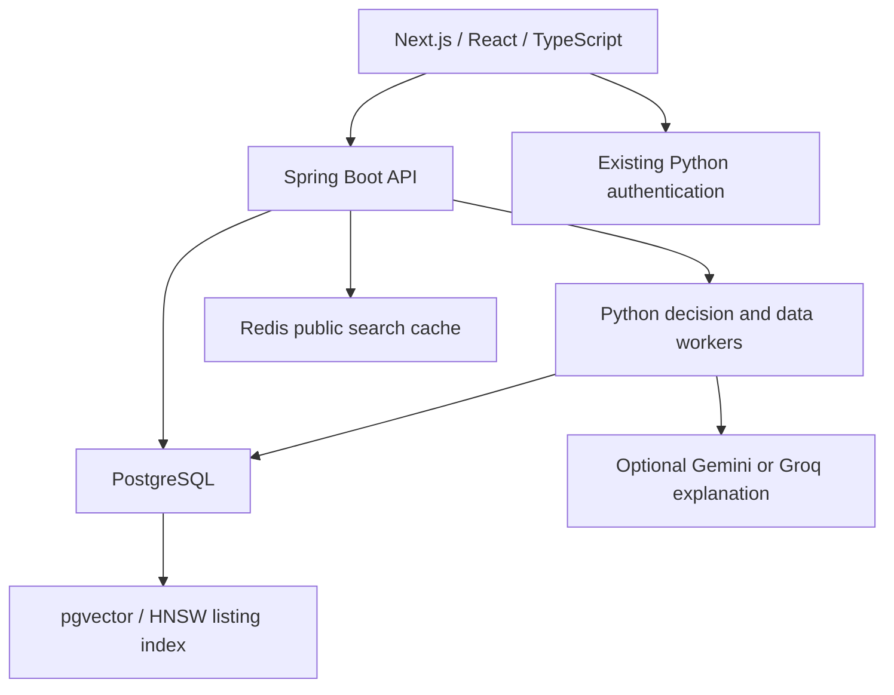

# RoleRadar: five-minute demo

RoleRadar is JobEngine V2. The existing listing ingestion, deduplication, search,
and application tools remain in the same repository and database.

## Start

Run `docker compose up --build -d` from the repository root, then open
http://localhost:3000/radar. The initial build downloads runtime dependencies.
The database schema and pgvector index are initialized before Spring starts.
No personal resume, scraped listings, or fabricated outcomes are seeded.

## Demonstrate the decision

1. Score the labeled sample with sponsorship set to **yes**. The posting's
   no-sponsorship restriction must veto the role even when skills match.
2. Set sponsorship to **no** and score again. Open a requirement to inspect the
   exact stored evidence text and its source path. Missing skills remain gaps.
3. Review the arithmetic. Semantic feature hashing contributes at most 20%; the
   score is a transparent heuristic, not a probability of an interview or offer.
4. Register a local account, replace sample data with your own, explicitly enable
   saving, and score. Reopen the saved decision from the journal.
5. Record **applied**, then **interview**, then **rejected**. Current status shows
   rejected; evaluation retains interview as the furthest progress signal.
   Rescoring after application cannot rewrite the original prediction.
6. Evaluation withholds metrics until ten resolved or progressed scored roles
   exist. Pending applications are not counted as failures. Synthetic demo
   outcomes do not establish real ranking quality.

## Service boundaries

Spring forwards only allowlisted v2 routes, preserves bearer authentication and
upstream errors, limits request time, and marks personal responses `no-store`.
Python owns decision logic and persistence. Redis caches public search results;
it does not cache resumes or per-user decisions. The current decision ranker
uses local feature hashing; the pgvector listing index remains the existing
retrieval facility, not a trained semantic encoder.

AI explanations are opt-in. Configure a provider key and an available model in
`.env`, then recreate the worker. No provider key is included. Missing keys,
provider failures, malformed output, or unsupported numeric claims fall back to
the deterministic explanation. Citation checks do not establish semantic
entailment. Disk caching is disabled unless explicitly configured; provider
retention policies still apply to material sent with AI enabled.

## Evidence for a technical interview

- Regression tests cover hard-constraint vetoes, evidence provenance, malformed
  model output, numeric fabrication, account isolation, saved evidence snapshots,
  prediction pinning, and censored pending outcomes.
- Java tests exercise a real HTTP worker stub plus MVC routing, error handling,
  timeout behavior, and CORS preflight.
- The web exposes failures and empty states and builds without external font
  downloads.
- Next.js uses webpack for both development and production. In this Windows
  workspace, Turbopack returned 404 for the existing Auth.js catch-all route;
  webpack's built route and live session endpoint were verified.
- NDCG, precision, lift, and score-bucket progression are evaluation tools.
  They are not demonstrated improvements until measured against real outcomes.

Run `python -m pytest`, `python -m ruff check src/ tests/`,
`python -m mypy src/roleradar --ignore-missing-imports`,
`mvn -f services/core-api/pom.xml test`, and from `web`, `npm run lint`,
`npx tsc --noEmit`, and `npm run build`.

## Known limits

Extraction uses a curated taxonomy and regexes. Unusual requirements can be
missed. Resume input currently uses structured JSON, and the AI explanation
does not perform full factual entailment checking. The first outcome pins one
prediction per user and posting; repeated application cycles to an identical
posting are not modeled separately. Existing v1 tracker rows and v2 decision
outcomes remain separate records inside the same product; use the decision
journal for ranking evaluation. Historical saved decisions created before
evidence snapshots were added may have no quoted evidence to display.
