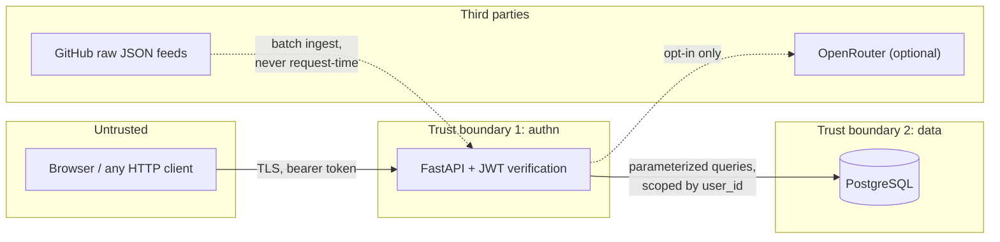

# Threat model

Scope: the deployed FastAPI service, its PostgreSQL database, and the Next.js
client. The CLI is out of scope — it runs on the user's own machine with the
user's own data and grants no privilege they don't already have.

## Assets, ranked by what it costs to lose them

1. **User credentials.** Password reuse means a leak here damages accounts that
   have nothing to do with this project. Highest severity despite the app
   itself being low-stakes.
2. **Users' application data.** Where someone is interviewing is genuinely
   sensitive — it can reveal that they're leaving a current employer.
3. **Service availability.** Losing it is embarrassing, not damaging.
4. **The jobs table.** Public data, derived from public sources, rebuildable in
   minutes. Effectively worthless to an attacker.

## Trust boundaries

## Threats (STRIDE), with current status

| # | Threat | Category | Impact | Status |
|---|---|---|---|---|
| T1 | Credential stuffing / brute force against `/api/auth/login` | Spoofing | Account takeover | **Open** — no rate limiting. See below. |
| T2 | Password database disclosure | Information disclosure | Severe | **Mitigated** — bcrypt with per-password salt; plaintext never stored or logged |
| T3 | SQL injection via query filters | Tampering | Total compromise | **Mitigated** — SQLAlchemy Core parameter binding throughout; no string-interpolated SQL anywhere |
| T4 | Horizontal privilege escalation — reading another user's applications | Information disclosure | Severe | **Mitigated** — every tracker query goes through `_owned()`, which applies the `user_id` filter centrally; regression-tested |
| T5 | JWT forgery | Spoofing | Account takeover | **Partly mitigated** — HS256 with a server-side secret. **`JOBENGINE_SECRET_KEY` must be set in production**; a weak or default secret makes this trivial |
| T6 | Stolen token replay | Spoofing | Account takeover until expiry | **Partly mitigated** — tokens expire. No revocation list, so a stolen token is valid until it expires |
| T7 | Resource exhaustion via connection pool | Denial of service | Availability | **Mitigated** — bounded pool + `pool_timeout` + 503 with `Retry-After` instead of unbounded queueing |
| T8 | Unbounded result sets (`?max=100000`) | Denial of service | Availability | **Open** — `max` is not clamped server-side |
| T9 | Permissive CORS (`allow_origins=["*"]`) | Elevation of privilege | Token theft via hostile origin | **Open by default** — `JOBENGINE_CORS_ORIGINS` must be set to the real frontend origin before public deployment |
| T10 | Poisoned upstream feed (compromised SimplifyJobs repo) | Tampering | Malicious URLs shown to users | **Open** — feed content is trusted; only shape is validated |
| T11 | Prompt injection via job descriptions into the optional LLM step | Tampering | Bad generated cover letter | **Low** — output is local, reviewed by the user before use, never executed |
| T12 | Analytics table growth | Denial of service | Disk exhaustion over months | **Open** — no retention policy or partitioning yet |
| T13 | Demo account abuse | Tampering | Defaced demo | **Accepted** — scoped like any user, `seed-demo --reset` restores it |
| T14 | Secrets in logs | Information disclosure | Credential leak | **Mitigated** — auth failures log the reason, never the credential |

## The open items, honestly

These are not oversights I'd hide in an interview; they're deliberate ordering.

**T1 (no rate limiting) is the most serious.** An attacker can attempt
unlimited passwords against `/api/auth/login`. bcrypt makes each attempt
expensive, which slows an attacker down but also means the endpoint doubles as
a CPU-exhaustion vector. The fix is per-IP and per-account rate limiting with
exponential backoff. It is not done yet.

**T9 (CORS) is a footgun.** The default is `*` because this started as a local
tool. That default is correct for `localhost` and dangerous in production —
any site could make authenticated cross-origin requests with a user's token.
The deployment guide sets `JOBENGINE_CORS_ORIGINS`, but the *default* being
permissive means forgetting is silent. Inverting the default is the right fix.

**T8 (unbounded `max`) is a one-line fix** that hasn't been made: clamp to a
few hundred. A single request asking for every row can hold a connection long
enough to trigger T7 for everyone else.

**T6 (no revocation)** means "log out everywhere" doesn't exist. For this
threat profile a short expiry is an acceptable substitute; for anything
handling money it would not be.

## Explicitly out of scope

- **Physical and cloud-provider compromise.** Delegated to the platform.
- **Malicious authenticated users attacking their own data.** They can already
  edit it; there is no integrity requirement to violate.
- **The DOL and SimplifyJobs data being wrong.** It sometimes is. The product
  presents sponsorship as a *signal with a match count*, not a guarantee, for
  exactly this reason.

## What would change with real users

At double-digit users this model is adequate. Before anything that stores more
than job applications, three things become mandatory rather than nice: rate
limiting (T1), a restrictive CORS default (T9), and token revocation (T6).
