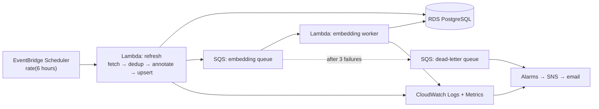

# Infrastructure

Terraform for the AWS scheduled data-refresh pipeline and CloudWatch monitoring.

## Status: written, **never applied, and not yet validated**

No `terraform apply` has been run. Nothing in this directory has provisioned a
real resource, and no AWS bill exists for this project.

**`terraform validate` has also not been run** — it needs `terraform init`,
which downloads the AWS provider, which needs network and a working Docker or
local Terraform install. So unlike the Java service (which is compiled and
load-tested) and the Python package (65 passing tests), this HCL is
**unverified**: it may contain syntax or type errors. Run this before trusting
any of it:

```bash
terraform -chdir=infra init -backend=false && terraform -chdir=infra validate
```

Treat what follows as a reviewed design expressed in code, not as a description
of running — or even parsed — infrastructure.

That is a deliberate choice, not an omission —
[`docs/cost-estimate.md`](../docs/cost-estimate.md) works through why the live
demo belongs on Railway/Render at ~$10/mo rather than ~$29–43/mo on AWS, where
an Application Load Balancer alone would cost more than the database and compute
combined. The interesting parts of the AWS design — the scheduled pipeline and
the alarm thresholds — are worth being able to show and explain regardless of
where the demo actually runs.

## What it provisions



**Why SQS sits between the two Lambdas.** Ingest and embedding have different
runtime profiles: dedup+annotate finishes in about 5 seconds for 32k records,
while embedding those records is CPU-bound and long. Putting them in one
function means the whole refresh inherits the slow half's timeout and one
embedding failure fails the entire refresh. The queue decouples them, gives
per-message retries, and makes failures visible as queue depth rather than as a
Lambda that quietly timed out. The dead-letter queue is what turns "some records
silently never got embedded" into an alarm.

**This is the honest version of "moved slow processing to SQS."** The
decoupling is real and the reasoning is sound, but the latency improvement has
not been measured, because this has not been deployed.

## Files

| File | Contents |
|---|---|
| `main.tf` | Provider, variables, locals |
| `pipeline.tf` | EventBridge schedule, Lambdas, SQS queues, IAM |
| `monitoring.tf` | CloudWatch dashboard, alarms, SNS topic |
| `terraform.tfvars.example` | Copy to `terraform.tfvars` and fill in |

## Before applying anything

```bash
cp infra/terraform.tfvars.example infra/terraform.tfvars
```

```bash
terraform -chdir=infra init
```

```bash
terraform -chdir=infra plan
```

Read the plan. `terraform plan` costs nothing and shows exactly what would be
created; `apply` starts billing. The RDS instance is the line item that will
keep charging if forgotten — `terraform destroy` is the off-switch.

## What is deliberately not here

- **No VPC/subnet/security-group module.** Assumes an existing VPC passed in as
  a variable. Writing a network module for a portfolio project is a large amount
  of code that demonstrates copying a reference architecture rather than
  understanding one.
- **No ECS service.** The API runs on Railway. Adding ECS+ALB would triple the
  cost for a strictly worse demo — see the cost estimate.
- **No Terraform remote state.** Local state is wrong for a team and fine for a
  single operator who has never applied it.
